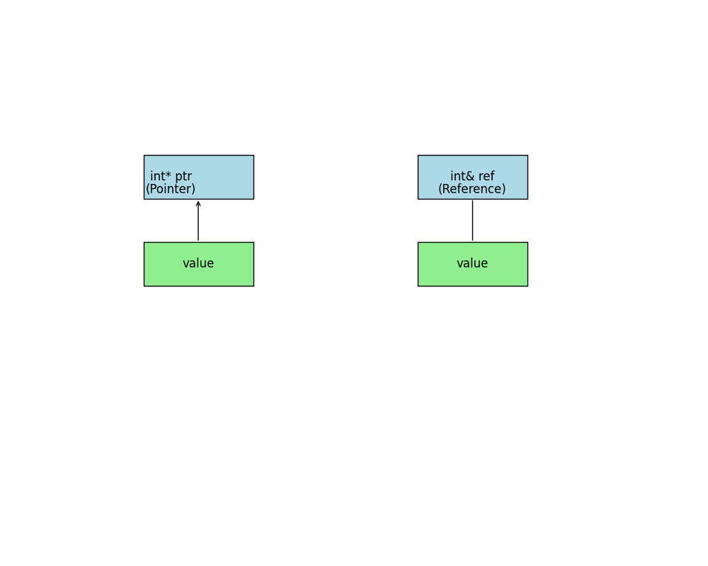

# C++ Pointers vs References: A Visual Guide

This repository provides a visual comparison between pointers and references in C++. It includes a diagram that illustrates the key differences and a PlantUML source file used to generate the diagram.

## Diagram
The diagram illustrates the basic differences between pointers and references, and it includes a comparison table with key features. 

The diagram illustrates the basic differences between pointers and references, and it includes a comparison table with key features. 

## Comparison

| Feature         | Pointer                     | Reference                     |
|-----------------|-----------------------------|-------------------------------|
| Declaration     | `int* ptr = &variable;`     | `int& ref = variable;`        |
| Initialization  | Can be uninitialized        | Must be initialized           |
| Reassignment    | Can point to different variables | Cannot be reassigned        |
| Nullability     | Can be `nullptr`            | Cannot be null                |
| Dereferencing   | Requires `*` to access value | Automatically dereferenced    |
| Memory Address  | Holds the address of a variable | Acts as an alias            |

## Files

- `diagram.puml`: PlantUML source file for the diagram.
- `diagram.png`: PNG image of the diagram.
- `README.md`: This README file.

## Usage

1. Clone the repository.
2. View the `diagram.png` file to understand the comparison between pointers and references in C++.
3. Modify the `diagram.puml` file if you need to update the diagram.

## License

This project is licensed under the MIT License.
